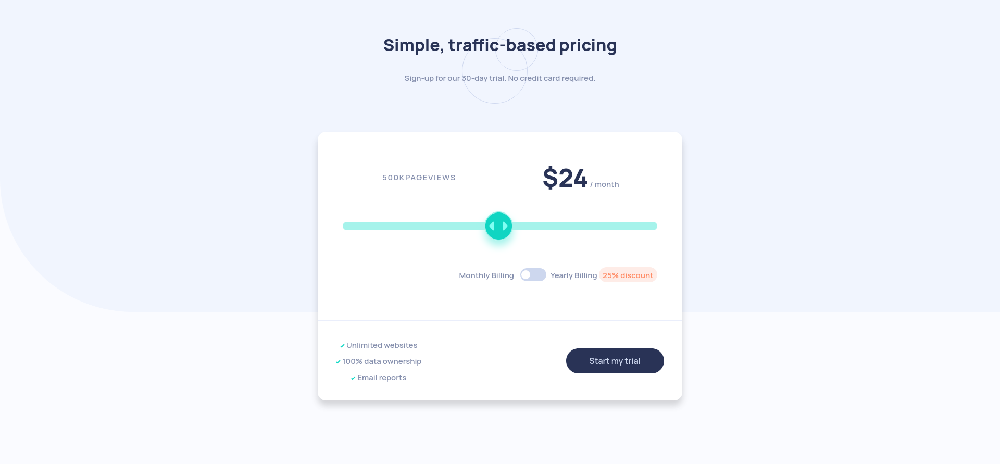

# Frontend Mentor - Interactive pricing component solution

This is a solution to the [Interactive pricing component challenge on Frontend Mentor](https://www.frontendmentor.io/challenges/interactive-pricing-component-t0m8PIyY8). Frontend Mentor challenges help you improve your coding skills by building realistic projects. 

## Table of contents

- [Overview](#overview)
  - [The challenge](#the-challenge)
  - [Screenshot](#screenshot)
  - [Links](#links)
- [My process](#my-process)
  - [Built with](#built-with)
  - [What I learned](#what-i-learned)
  - [Continued development](#continued-development)
  - [Useful resources](#useful-resources)
- [Author](#author)

## Overview

### The challenge

Users should be able to:

- View the optimal layout for the app depending on their device's screen size
- See hover states for all interactive elements on the page
- Use the slider and toggle to see prices for different page view numbers

### Screenshot



### Links

- Solution URL: [github](https://github.com/RadasinR/interactive-pricing-component.git)
- Live Site URL: [Add live site URL here](https://your-live-site-url.com)

## My process

### Built with

- Semantic HTML5 markup
- CSS custom properties
- Flexbox
- CSS Grid
- Mobile-first workflow

### What I learned

I learnd to create a toggle button and how to style a input range.

```html
<!-- toggle button -->
  <div>
    <input class="sliderCheck" type="checkbox" name="monthlyYearly" id="monthlyYearly" />
    <label class="slider" for="monthlyYearly">Toggle</label>
  </div>

```
```css
/* toggle button css */
.sliderCheck {
  width: 0;
  height: 0;
  visibility: hidden;
}
.slider {
  cursor: pointer;
  text-indent: -99999px;
  width: 50px;
  height: 25px;
  background: var(--LIGHT-GRAYISH-BLUE);
  display: block;
  border-radius: 7rem;
  position: relative;
 
}
.slider::after {
  content: "";
  position: absolute;
  top: 13%;
  left: 4%;
  width: calc(18px - 1%);
  height: calc(18px - 1%);
  background: #fff;
  border-radius: 50%;
  transition: 0.5s;
}
.slider:hover {
  background-color: var(--STRONG-CYAN);
}
.sliderCheck:checked + .slider {
  background-color: var(--STRONG-CYAN);
}
.sliderCheck:checked + .slider::after {
  left: calc(100% - 5px);
  transform: translateX(-100%);
}
/* input range */
.pricing__range::-moz-range-track,
.pricing__range::-webkit-slider-runnable-track {
  background-color: var(--SOFT-CYAN);
  height: clamp(0.5rem, 0.2rem + 2vw, 1rem);
  border-radius: 100px;
}
.pricing__range::-moz-range-thumb,
.pricing__range::-webkit-slider-thumb {
  width: clamp(2rem, 0.8rem + 2vw, 4rem);
  height: clamp(2rem, 0.8rem + 2vw, 4rem);
  background-color: var(--STRONG-CYAN);
  background-image: url("/images/icon-slider.svg");
  background-size: 70%;
  background-position: center;
  background-repeat: no-repeat;
  border-radius: 50%;
  border: 2px solid var(--SOFT-CYAN);
  box-shadow: 0 10px 15px var(--SOFT-CYAN);
}

.pricing__range::-moz-range-thumb:active {
  background-color: var(--SOFT-CYAN);
}
.pricing__range:focus::-webkit-slider-thumb,
.pricing__range:focus::-moz-range-thumb {
    border: 1px solid var(--GRAYISH-BLUE); 
}
```

### Continued development
I will continue to learn web design.

### Useful resources

- [Input range styling](https://www.smashingmagazine.com/2021/12/create-custom-range-input-consistent-browsers/) - helped me with styling the input range

## Author

- Frontend Mentor - [@yourusername](https://www.frontendmentor.io/profile/Radasin)

